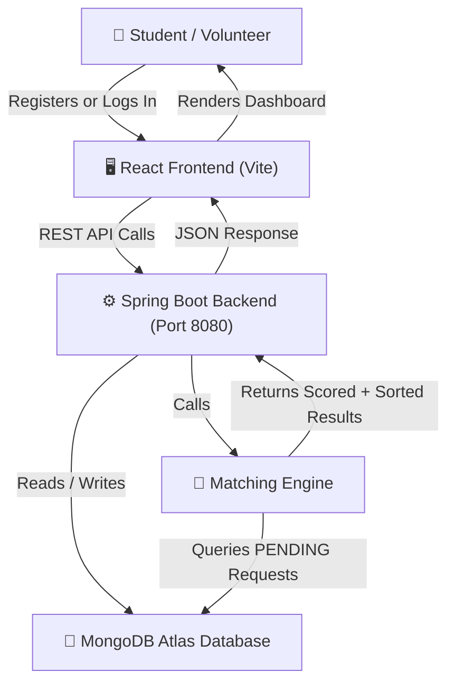
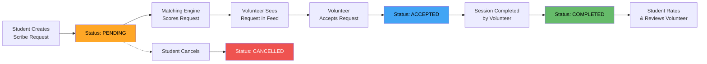
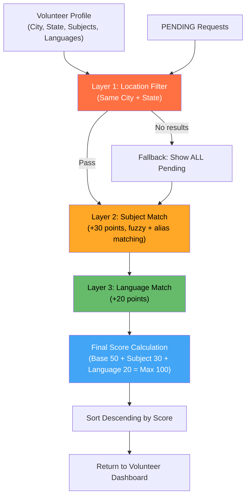
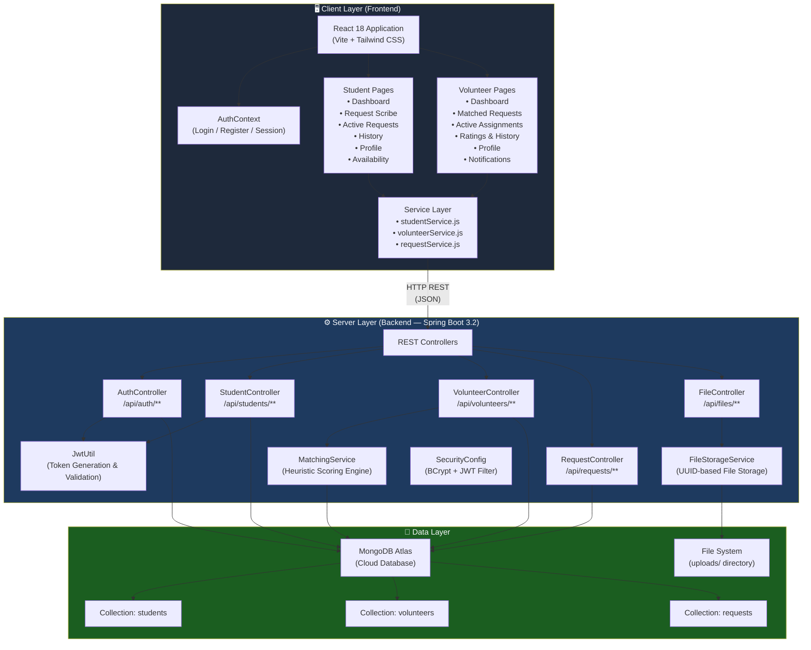

# Mini Project Synopsis

## AI-Powered Scribe Matching Platform
### (Java Based Scribe Allocation System for Students with Disabilities)

---

# 1. Group Members

| Sr. No. | Name | Roll No. | Role |
|---------|------|----------|------|
| 1 | _[Name]_ | _[Roll No.]_ | _[Role]_ |
| 2 | _[Name]_ | _[Roll No.]_ | _[Role]_ |
| 3 | _[Name]_ | _[Roll No.]_ | _[Role]_ |
| 4 | _[Name]_ | _[Roll No.]_ | _[Role]_ |

> **Note:** Please fill in the group member details before submission.

---

# 2. Problem Statement

Students with disabilities — particularly those who are visually impaired — face significant challenges when it comes to writing examinations. These students require the assistance of a **scribe** (a person who writes the exam on their behalf), but finding a suitable scribe is often a difficult and time-consuming process.

Currently, most institutions rely on informal, manual methods for connecting students with scribes. This leads to several problems:

- **Difficulty in finding a match:** Students struggle to find a scribe who is available at the right time, speaks their preferred language, and has knowledge of the required subject.
- **Location constraints:** Students need scribes who are located in the same city to be physically present during the exam.
- **No centralized platform:** There is no single system where students can post their scribe requirements and volunteers can browse and accept them.
- **No way to track quality:** Students have no way to verify a volunteer's past performance or reliability before working with them.
- **Manual coordination:** All communication and scheduling is done manually, increasing the chance of last-minute cancellations or mismatches.

There is a clear need for an **automated, web-based platform** that connects students with volunteer scribes using intelligent matching, streamlines the entire request lifecycle, and provides transparency through ratings and session history.

---

# 3. Abstract

The **AI-Powered Scribe Matching Platform** is a full-stack web application designed to connect students with disabilities — especially visually impaired students — with volunteer scribes for examinations. The system provides separate dashboards for students and volunteers, each with role-specific features.

Students can register, create scribe requests with exam details (subject, date, time, duration, language preference), upload study materials for the scribe's preparation, and track their request status through a defined lifecycle: **Pending → Accepted → Completed**. After a session is completed, students can rate and review the volunteer.

Volunteers can register with their subject expertise, language proficiency, and location. They receive a curated feed of matching scribe requests, filtered and scored by a **multi-layered heuristic matching engine** that considers location (city and state), subject match (with fuzzy alias-based matching), and language compatibility.

The frontend is built with **React 18** using **Vite** as the build tool and **Tailwind CSS** for styling. The backend is a **Spring Boot 3.2** REST API using **Java 17**, with **MongoDB Atlas** as the cloud database. Authentication is handled through **JWT tokens** with **BCrypt password hashing**. The system also supports multipart file uploads (up to 100MB) for exam preparation materials.

---

# 4. Data Flow / Workflow Diagram

## 4.1 Overall System Workflow

## 4.2 Request Lifecycle Flow

## 4.3 Matching Engine Scoring Logic

---

# 5. Module-Wise Scope

## 5.1 Authentication Module
Handles user registration and login for both **students** and **volunteers** with separate endpoints. Passwords are hashed using **BCrypt** before storage. On successful login (for students), a **JWT token** is generated and returned to the client. Role-based routing on the frontend redirects users to their respective dashboards.

## 5.2 Student Dashboard Module
Provides students with an overview of their account, including statistics on active and completed requests. Students can navigate to create new scribe requests, view active requests with assigned volunteer details (name, phone, rating), browse request history, update their profile, and view available volunteers in their area.

## 5.3 Volunteer Dashboard Module
Serves as the primary workspace for volunteers. Displays a curated feed of **matching scribe requests** sorted by relevance score. Volunteers can view their active assignments, session history with student ratings, their overall rating and completed session count, and manage their profile including subjects, languages, and availability schedule.

## 5.4 Matching Engine Module
The core intelligence of the system. Implements a **multi-layered heuristic scoring algorithm**:
- **Layer 1 (Hard Filter):** Filters PENDING requests to those matching the volunteer's city and state (+50 base points). Falls back to all PENDING requests if no location matches are found.
- **Layer 2 (Subject Scoring):** Awards +30 points for subject matches using both direct string matching and a built-in **subject alias map** (e.g., "Mathematics" matches "Calculus", "Algebra", "Statistics").
- **Layer 3 (Language Scoring):** Awards +20 points if the volunteer speaks the student's preferred language.
Results are sorted by score in descending order (maximum score: 100).

## 5.5 Request Management Module
Manages the full lifecycle of scribe requests. Students create requests with exam details (subject, date, time, duration, location, language, special requirements). Volunteers can accept PENDING requests and mark ACCEPTED requests as COMPLETED. Students can cancel requests. The system auto-populates student name, disability type, city, and state from the student's profile when creating a request.

## 5.6 File Upload Module
Allows students to upload **study materials** (exam preparation documents) when creating scribe requests. Supports multiple file uploads with a maximum size of **100MB per file**. Files are stored on the server with UUID-based naming to prevent conflicts. Volunteers can download uploaded materials from the request details.

## 5.7 Rating & Review Module
Enables students to **rate (1–5 stars) and review** volunteers after a session is completed. The system calculates a **rolling average rating** for each volunteer using the formula: `newAvg = ((currentAvg × totalRatings) + newRating) / (totalRatings + 1)`. Each session can only be rated once (duplicate ratings are rejected). The volunteer's session count is also incremented upon completion.

## 5.8 Profile Management Module
Both students and volunteers can view and update their profiles. **Student profiles** include personal info, disability details, academic information, and communication preferences. **Volunteer profiles** include personal info, location, subject expertise, known languages, and a weekly availability schedule (morning/afternoon/evening per day). Students can also upload a profile picture via the file upload service.

## 5.9 Database Module
Uses **MongoDB Atlas** (cloud-hosted) as the primary database. Three main collections:
- `students` — stores student registration and profile data
- `volunteers` — stores volunteer profiles, subjects, languages, availability, and rating statistics
- `requests` — stores scribe requests with exam details, status, timestamps, and review data

Custom repository methods handle location-based filtering (case-insensitive), status-based queries, and ordered history retrieval.

---

# 6. Technology Selected

| Layer | Technology | Version / Details |
|-------|-----------|-------------------|
| **Frontend Framework** | React | 18.2 |
| **Frontend Build Tool** | Vite | 5.2 |
| **Frontend Styling** | Tailwind CSS | 3.4 |
| **Frontend Routing** | React Router DOM | 6.22 |
| **Frontend Icons** | Lucide React, React Icons | 0.344, 5.6 |
| **Backend Framework** | Spring Boot | 3.2.3 |
| **Backend Language** | Java | 17 |
| **Database** | MongoDB Atlas | Cloud-hosted (MongoDB) |
| **ORM / Data Access** | Spring Data MongoDB | (via Spring Boot Starter) |
| **Authentication** | JWT (JSON Web Tokens) | jjwt 0.11.5 |
| **Password Hashing** | BCrypt | (via Spring Security) |
| **Security Framework** | Spring Security | (via Spring Boot Starter) |
| **Code Generation** | Lombok | (compile-time annotations) |
| **Build Tool (Backend)** | Apache Maven | POM-based |
| **API Architecture** | REST API | JSON request/response |
| **CORS Configuration** | Spring WebMvcConfigurer | Custom WebConfig class |

---

# 7. System Architecture Diagram

---

# 8. Key Features

### Student Side
- ✅ **Student Registration & Login** — Secure registration with BCrypt password hashing and JWT-based authentication
- ✅ **Create Scribe Request** — Submit a request with subject, exam date/time, duration, language, location, and special requirements
- ✅ **Upload Study Materials** — Attach multiple files (up to 100MB each) for the volunteer scribe's exam preparation
- ✅ **Active Request Tracking** — View all pending and accepted requests with assigned volunteer details (name, phone, rating)
- ✅ **Request Cancellation** — Cancel a pending request if no longer needed
- ✅ **Session Completion & Rating** — Mark a session as completed and submit a 1–5 star rating with a written review
- ✅ **Request History** — View past completed and cancelled requests with volunteer information
- ✅ **Profile Management** — Update personal info, disability details, academic info, communication preferences, and profile picture
- ✅ **View Available Volunteers** — Browse registered volunteers in the system

### Volunteer Side
- ✅ **Volunteer Registration & Login** — Register with subjects, languages, city/state, and availability schedule; login with BCrypt password verification
- ✅ **Smart Matched Request Feed** — Receive a curated, scored list of pending scribe requests ranked by location, subject, and language compatibility
- ✅ **Accept Requests** — Accept a pending scribe request to become the assigned volunteer
- ✅ **Active Assignments View** — See all currently accepted assignments with student and exam details
- ✅ **Mark Session Complete** — Mark an accepted assignment as completed after the exam
- ✅ **Session History & Ratings** — View all completed sessions with ratings and reviews given by students
- ✅ **Rolling Average Rating** — Automatic calculation of average rating across all completed sessions
- ✅ **Availability Schedule Management** — Set weekly availability (morning/afternoon/evening for each day of the week)
- ✅ **Profile Management** — Update name, phone, city, state, subjects, languages, and date of birth
- ✅ **Certificate Data** — View a summary of total sessions completed, average rating, and registered subjects

### System-Wide
- ✅ **Multi-Layered Heuristic Matching Engine** — Location hard filter + fuzzy subject matching with alias support + language matching
- ✅ **Role-Based Routing** — Automatic redirection to student or volunteer dashboard based on user role
- ✅ **Protected Routes** — Unauthenticated users are redirected to the login page
- ✅ **JWT Authentication** — Stateless token-based authentication with configurable expiration
- ✅ **CORS Support** — Configured for cross-origin requests between frontend and backend
- ✅ **RESTful API Design** — Clean, well-structured REST endpoints for all operations

---

# 9. Screenshots of Output

### 9.1 Login Page
> _Insert screenshot here_

### 9.2 Student Registration Page
> _Insert screenshot here_

### 9.3 Volunteer Registration Page
> _Insert screenshot here_

### 9.4 Student Dashboard
> _Insert screenshot here_

### 9.5 Create Scribe Request Form
> _Insert screenshot here_

### 9.6 Active Requests (Student View)
> _Insert screenshot here_

### 9.7 Student Request History
> _Insert screenshot here_

### 9.8 Student Profile Page
> _Insert screenshot here_

### 9.9 Volunteer Dashboard (Matched Requests Feed)
> _Insert screenshot here_

### 9.10 Volunteer Active Assignments
> _Insert screenshot here_

### 9.11 Volunteer Ratings & History
> _Insert screenshot here_

### 9.12 Volunteer Profile Page
> _Insert screenshot here_

---

# 10. References

| Sr. No. | Reference | URL |
|---------|-----------|-----|
| 1 | React Documentation | [https://react.dev](https://react.dev) |
| 2 | Vite Documentation | [https://vitejs.dev](https://vitejs.dev) |
| 3 | Tailwind CSS Documentation | [https://tailwindcss.com/docs](https://tailwindcss.com/docs) |
| 4 | React Router Documentation | [https://reactrouter.com](https://reactrouter.com) |
| 5 | Spring Boot Documentation | [https://spring.io/projects/spring-boot](https://spring.io/projects/spring-boot) |
| 6 | Spring Data MongoDB Reference | [https://docs.spring.io/spring-data/mongodb/reference/](https://docs.spring.io/spring-data/mongodb/reference/) |
| 7 | Spring Security Documentation | [https://docs.spring.io/spring-security/reference/](https://docs.spring.io/spring-security/reference/) |
| 8 | MongoDB Atlas Documentation | [https://www.mongodb.com/docs/atlas/](https://www.mongodb.com/docs/atlas/) |
| 9 | JWT (JSON Web Tokens) Introduction | [https://jwt.io/introduction](https://jwt.io/introduction) |
| 10 | jjwt Library (Java JWT) | [https://github.com/jwtk/jjwt](https://github.com/jwtk/jjwt) |
| 11 | Lombok Project | [https://projectlombok.org](https://projectlombok.org) |
| 12 | Lucide React Icons | [https://lucide.dev](https://lucide.dev) |

---

> **Document prepared for:** Mini Project Submission  
> **Project Title:** AI-Powered Scribe Matching Platform  
> **Academic Year:** 2025–2026
